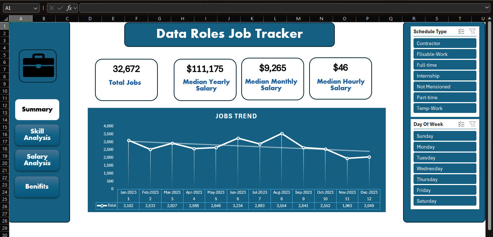

# Job Tracker Management System (Excel + Power Query + Power Pivot)

A comprehensive Excel-based job tracker and analytics dashboard for managing and analyzing job opportunities. Built using **Power Query** for data transformation and **Power Pivot** with DAX measures for interactive analysis.

The workbook is organized around four main sections (buttons/tabs):

- **Summary**
- **Skill Analysis**
- **Salary Analysis**
- **Benefits**

---

## 🎯 Purpose

This tool helps you:

- Track job applications .
- Analyze required skills and identify gaps.
- Compare salary offers across roles, industries, and countries.
- Evaluate benefits packages to support better career decisions.

Designed for data-driven job search and career planning, especially for data/analyst roles.

---

## 📁 Repository Structure

- `Job Tracker Dashboard.xlsx` – Main Excel workbook containing:

  - Raw/loaded data (via Power Query)
  - Data model (Power Pivot)
  - Dashboards and analysis sheets (Calc,Summary, Skill Analysis, Salary Analysis, Benefits)
- `data/` – Sample or source data files (CSV, Excel, etc.)
- `images/` _ images in Dashboard.
- `README.md` – This file

---

## 🧩 Features

### 1. Summary

High-level overview of your job pipeline:

- Total jobs tracked
- Key KPIs (e.g., Salary overview).
- Schedule Type Slicer (Full time, Part time, ..)

### 2. Skill Analysis

Deep dive into required and possessed skills:

- Most frequent skills in job descriptions
- Total mensioned skills in job titles.
- Skills by job title / industry.
- Priority skills to focus on for upskilling

### 3. Salary Analysis

Salary benchmarking and comparison:

- Median salary by role, experience level, and country
- Arab vs. non‑Arab countries salary comparison (using DAX measures).

### 4. Benefits

Benefits comparison across offers:

- Categorized benefits (health, remote work, etc.)
- Benefit score or ranking per job/offer
- Visual comparison of total compensation packages.

---

## 🛠️ Technical Details

- **Tool:** Microsoft Excel (2016+ recommended)
- **Data Loading & Transformation:** Power Query (M)
- **Data Model & Measures:** Power Pivot (DAX)
- **Visuals:** PivotCharts, slicers, and form controls (buttons/tabs)

### Key DAX Measures (examples)

- `Median Salary Arab Countries`
- `Median Salary Non-Arab Countries`
- `Salary Gap Arab vs Non-Arab`
- `Skills per job`
- `Degree Mensioned%`
- `Health Insurance%`

---

## 🚀 How to Use

1. **Open the workbook**Open `Job Tracker Dashboard.xlsx` in Excel (Windows recommended for full Power Pivot support).
2. **Refresh data**

   - Go to the **Data** tab → **Get Data** → **Data source setting** → Choose`data_jobs_salary_al.xlsx`
   - Go to the **Data** tab → **Refresh All**
   - Or right-click any query in **Queries & Connections**→ **Refresh**
3. **Navigate using the main buttons/tabs**Use the four main navigation buttons/sheets:

   - **Summary**
   - **Skill Analysis**
   - **Salary Analysis**
   - **Benefits**
4. **Apply filters**Use slicers (e.g., Country, Job Title, Experience Level) to customize the views.

---

## 📊 Data Model Overview

Main tables in the data model (names may vary slightly):

- `Jobs` – Core job/application data (title, company, country, status, dates, etc.)
- `Skills` – Skills extracted from job descriptions
- `Salaries` – Salary information (min, max, median, currency, etc.)
- `Benefits` – Benefits details per job/offer
- `Countries` – Country reference table (including Arab / non‑Arab flag if used)

Relationships are defined in Power Pivot to enable cross-filtering between tables.

---

## 🧪 Example Analyses You Can Run

- “What is the median salary for Data Analyst roles in Arab countries vs. non‑Arab countries?”
- “Which 5 skills appear most often in the jobs I’ve applied to?”
- “What is my interview-to-application ratio by month?”
- “Which job offers have the best overall benefits score?”

---

## 🤝 Contributing / Reuse

This project is primarily for personal use and learning, but you’re welcome to:

- Fork the repo and adapt it to your own job tracking.
- Improve the data model, DAX measures, or visuals.
- Share ideas via issues or pull requests.

If you reuse this for teaching or public projects, please credit the original repo.

---

## 📄 License

This project is licensed under the [MIT License](LICENSE) – feel free to use and adapt it for your own job tracking and learning.

---

## 👤 Author

- **Name:** Abeer Mohamed Elmorshdy
- **LinkedIn:** [www.linkedin.com/in/abeer-mohamed-elmorshdy](https://www.linkedin.com/in/abeer-mohamed-elmorshdy/)
- **GitHub:** [github.com/Abeermorshdy](https://github.com/Abeermorshdy)
- Link To Online Da

Feel free to reach out if you have questions or suggestions!
